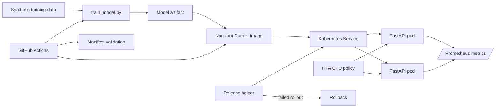

# MLOps Kubernetes Stack

A runnable reference project for the **model build → container → Kubernetes rollout → autoscaling → observability → rollback** lifecycle.

The model is intentionally tiny and synthetic. The point of the repository is the operational path around it.

## Architecture



## What is implemented

- deterministic scikit-learn training artifact;
- FastAPI prediction service;
- separate liveness, readiness and startup probes;
- Prometheus counters, histogram latency and model-readiness gauge;
- non-root Docker image;
- Kubernetes Deployment + ClusterIP Service + HPA;
- zero-unavailable rolling-update strategy;
- CPU requests/limits and scale-up/scale-down stabilization policies;
- PodDisruptionBudget;
- ingress/egress NetworkPolicy;
- dropped Linux capabilities, read-only root filesystem and seccomp runtime-default;
- pre-stop delay and termination grace period for draining;
- rollout helper with automatic rollback when deployment status fails;
- canary promotion gate for traffic sufficiency, error rate and p95 latency;
- CI that runs tests, Ruff, manifest checks, Docker build and container health/metrics smoke tests.

## Local run

```bash
pip install -r requirements.txt
python train_model.py
uvicorn app:app --reload
```

```bash
curl http://localhost:8000/health/live
curl http://localhost:8000/health/ready
curl http://localhost:8000/metrics
curl -X POST http://localhost:8000/predict \
  -H "Content-Type: application/json" \
  -d '{"features":[0.2,0.4,0.8,0.1]}'
```

## Build the container

```bash
docker build -t ml-model-service:local .
docker run --rm -p 8000:8000 ml-model-service:local
```

The image trains the public demo artifact at build time and then runs as UID `10001`.

## Kubernetes

```bash
kubectl apply -f k8s/deployment.yaml
kubectl apply -f k8s/resilience.yaml
```

The service starts with two replicas. HPA can scale to eight replicas based on CPU utilization. Scale-down is intentionally slower than scale-up to reduce oscillation.

### Release and rollback

Use immutable tags or image digests in a real deployment:

```bash
python scripts/release.py deploy \
  --image ghcr.io/cagataykavas/mlops-kubernetes-stack@sha256:<digest> \
  --namespace ml
```

If `kubectl rollout status` fails, the helper requests `kubectl rollout undo` and waits for the previous revision to become healthy.

Manual rollback is also available:

```bash
python scripts/release.py rollback --namespace ml
```

### Canary quality gate

Kubernetes readiness proves that a candidate can serve requests; it does not prove that the
candidate is safe to promote. `scripts/canary_gate.py` evaluates a fixed observation window
for the baseline and candidate model versions before full rollout.

The gate requires minimum traffic and enforces both absolute and relative budgets:

- maximum candidate error rate;
- maximum error-rate increase over baseline;
- maximum candidate/baseline p95 latency ratio;
- distinct model-version evidence.

It reports all violations deterministically in a JSON-ready decision. Invalid or incomplete
evidence fails closed. Example library usage:

```python
from scripts.canary_gate import CanaryPolicy, evaluate_file

decision = evaluate_file("canary-evidence.json", CanaryPolicy(min_requests=1000))
if not decision.promote:
    raise SystemExit(decision.to_dict())
```

The input contains aggregate window evidence, not synthetic benchmark claims. Producing those
aggregates from Prometheus and wiring the decision to traffic shifting are deployment-specific
responsibilities. Error-rate comparisons are deterministic policy checks, not statistical
significance tests; low-traffic windows are rejected rather than over-interpreted.

## Health semantics

`/health/live` only answers whether the process is alive. `/health/ready` additionally requires the model artifact to be loaded. Kubernetes therefore stops routing traffic to an unready model without necessarily restarting a healthy process.

## Observability

`/metrics` is Prometheus text format and exposes:

- `ml_predictions_total{predicted_class,model_version}`;
- `ml_prediction_latency_seconds` histogram;
- `ml_model_ready` gauge.

This gives the repository enough structure to discuss request rate, latency distributions, rollout comparison by model version and readiness alarms.

## Reliability and security choices

- `maxUnavailable: 0` keeps capacity during rolling updates.
- PDB protects voluntary disruptions from taking every replica down.
- startup/readiness/liveness probes have different responsibilities.
- pre-stop + termination grace time provide a simple connection-draining window.
- NetworkPolicy narrows traffic instead of leaving every pod implicitly reachable.
- the container is non-root, cannot escalate privileges, drops capabilities and uses a read-only root filesystem.

## Interview topics

This project is designed to support concrete discussion of:

**Docker layers · Kubernetes Deployment/Service · probes · HPA · requests vs limits · rolling updates · canary gates · rollback · PDB · NetworkPolicy · Prometheus · immutable image tags · CI/CD · graceful termination · readiness vs liveness.**
